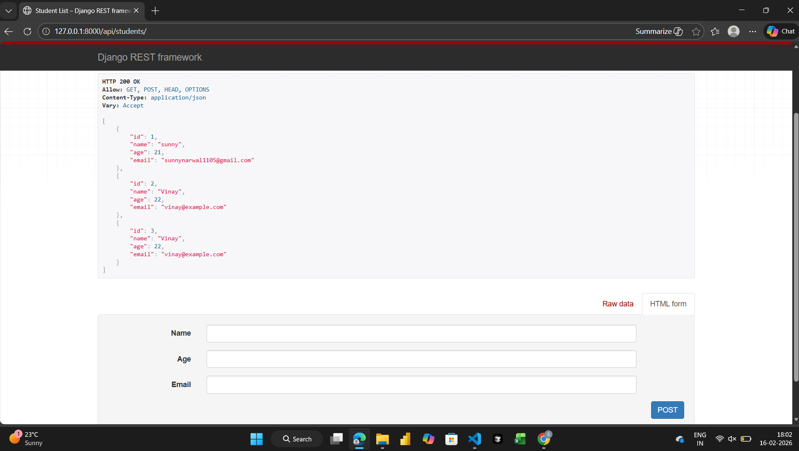
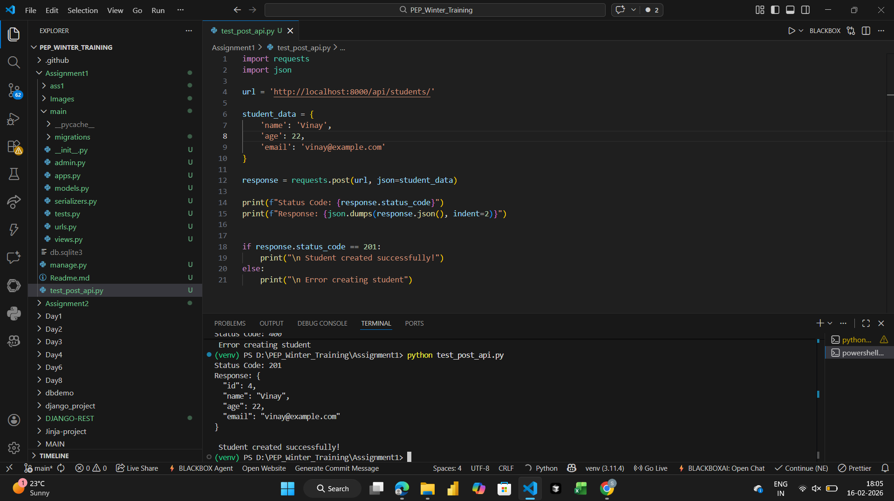
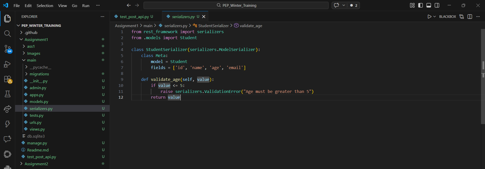
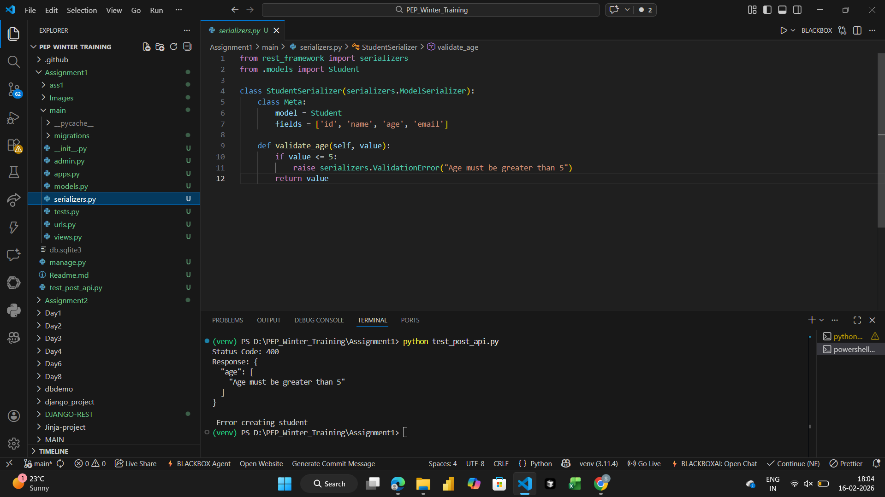

# Assignment 1 - Django REST API

## Overview
This project is a Django REST Framework application that provides a REST API for managing Student records. It demonstrates the basics of Django REST Framework (DRF) including serializers, viewsets, and URL routing.

## Features Implemented

### 1. Student Model
- **Model**: `Student`
- **Fields**: (based on the views and serializers)
- Provides database storage for student data

### 2. Student Serializer
- **Serializer**: `StudentSerializer`
- Converts Django model instances to JSON and vice versa
- Handles data validation

### 3. Student ViewSet
- **ViewSet**: `StudentViewSet`
- Inherits from `ModelViewSet`
- Provides complete CRUD operations:
  - `list` - GET all students
  - `create` - POST new student
  - `retrieve` - GET single student
  - `update` - PUT/PATCH student
  - `destroy` - DELETE student

### 4. REST API Endpoints
- API endpoints for Student CRUD operations
- JSON response format

## Project Structure
```
Assignment1/
├── ass1/                  # Django project settings
│   ├── settings.py
│   ├── urls.py
│   └── ...
├── main/                  # Main application
│   ├── models.py         # Student model
│   ├── views.py          # StudentViewSet
│   ├── serializers.py    # StudentSerializer
│   ├── urls.py           # URL routing
│   └── ...
├── Images/                # Screenshots
│   ├── Screenshot.png
│   ├── Screenshot1.png
│   ├── Screenshot2.png
│   └── Screenshot3.png
├── test_post_api.py       # API test file
└── README.md
```

## How to Run

1. Navigate to the Assignment1 directory:
   
```
   cd Assignment1
   
```

2. Run migrations:
   
```
   python manage.py migrate
   
```

3. Start the development server:
   
```
   python manage.py runserver
   
```

4. Access the API at:
   
```
   http://localhost:8000/api/students/
   
```

## API Testing
The project includes `test_post_api.py` which can be used to test the REST API endpoints.

## Screenshots

Below are the screenshots showing the API functionality:

### API Endpoint - List Students


### API Endpoint - Create Student


### API Response


### API Test Results


---

## Additional Notes
- This assignment demonstrates Django REST Framework fundamentals
- Uses ModelViewSet for automatic CRUD operations
- Serializer handles data validation and transformation
