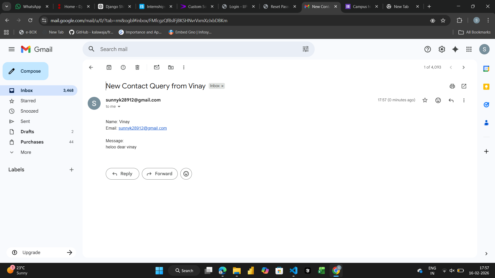

# Assignment 2 - Django User Registration System

## Overview
This project is a Django-based user registration system that allows users to register with their name and email address. Upon successful registration, the system sends a welcome email to the registered user.

## Features Implemented

### 1. User Registration Model
- **Model**: `UserRegistration`
- **Fields**:
  - `name`: CharField (max_length=100)
  - `email`: EmailField (unique=True)
  - `created_at`: DateTimeField (auto_now_add=True)

### 2. Registration Form
- **Form**: `RegistrationForm` (Django ModelForm)
- **Fields**: name, email
- **Validation**: Django's built-in form validation

### 3. Registration View
- **View**: `register_user`
- **Functionality**:
  - Handles GET requests to display the registration form
  - Handles POST requests to process form submission
  - Validates form data
  - Saves user to database
  - Sends welcome email to the registered user
  - Displays success page after registration

### 4. Email Integration
- Uses Django's `send_mail` function
- Sends welcome email with subject "Welcome to Our Platform"
- Includes user's name in the email message

### 5. Templates
- `register.html`: Registration form template
- `success.html`: Success page displayed after registration

## Project Structure
```
Assignment2/
├── ass2/                  # Django project settings
│   ├── settings.py
│   ├── urls.py
│   └── ...
├── main/                  # Main application
│   ├── models.py         # UserRegistration model
│   ├── forms.py          # RegistrationForm
│   ├── views.py          # register_user view
│   ├── urls.py           # URL routing
│   └── ...
├── templates/             # HTML templates
│   ├── register.html
│   └── success.html
├── images/                # Screenshots
└── README.md
```

## How to Run

1. Navigate to the Assignment2 directory:
   
```
bash
   cd Assignment2
   
```

2. Run migrations:
   
```
bash
   python manage.py migrate
   
```

3. Start the development server:
   
```
bash
   python manage.py runserver
   
```

4. Open your browser and navigate to:
   
```
   http://localhost:8000/register/
   
```

## Email Configuration
To send emails, configure the following in `settings.py`:
```
python
EMAIL_HOST = 'smtp.gmail.com'
EMAIL_PORT = 587
EMAIL_USE_TLS = True
EMAIL_HOST_USER = 'your-email@gmail.com'
EMAIL_HOST_PASSWORD = 'your-app-password'
```

## Screenshots

Below are the screenshots showing the application functionality:

### Registration Form


### Registration Success


---

## Additional Notes
- This assignment demonstrates Django fundamentals including models, forms, views, and email integration
- The project uses Django's built-in form validation
- Email sending is configured using Django's email backend
